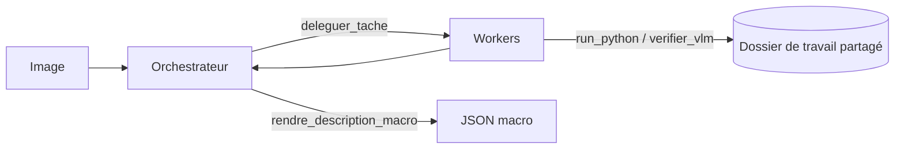
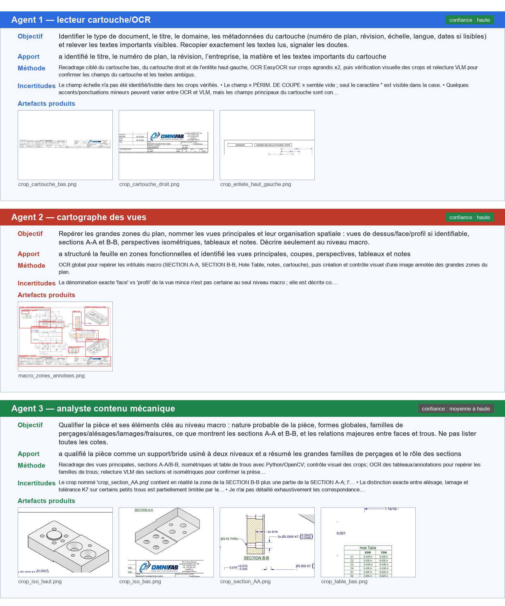

# Analyse/transcription de plan technique — IA agentique

Un orchestrateur LLM regarde un plan industriel, le découpe en sous-tâches, et
confie chacune à un agent worker. Chaque worker écrit et exécute son propre code
Python (OCR, recadrage, isolation de couleur, contours…), se relit par VLM, puis
rend son résultat. Sortie finale : une description macro en JSON, plus des
montages qui tracent « quel agent a fait quoi ».

'Exemple de plan provenant d'internet'
<p align="center">
    

</p>

## Le parti pris

Aucune technique d'analyse n'est codée en dur. Le système fournit un bac à sable
d'exécution et quelques outils génériques ; ce sont les agents qui décident, pour
*cette* image précise, quel code écrire et quelle vérification lancer — comme le
ferait un ingénieur qui zoome, recadre et recoupe avant de conclure.

- **Orchestrateur** — observe, planifie, délègue, puis assemble la description macro.
- **Worker** (un par sous-tâche) — reçoit un objectif, code, s'auto-vérifie, rend un JSON.
- **Mémoire partagée** — les crops et masques d'un worker restent disponibles pour les suivants.

Le code des agents s'exécute **localement, en sous-processus avec timeout** — ce
n'est pas une sandbox réseau. À réserver à des images de confiance (voir
[Limites](#limites)).

## Fonctionnement



L'orchestrateur planifie, délègue des tâches ciblées, reçoit les résultats, en
relance si besoin, puis produit un JSON validé contre un schéma (validation
maison, sans dépendance). Toute la boucle est bornée par des budgets
(`config.py`) : nombre de tours, de sous-tâches, d'exécutions de code, d'appels
VLM, et un temps total. Un code identique relancé est refusé, et un budget épuisé
force l'agent à conclure plutôt qu'à boucler.

<p align="center">
  
</p>

## Lancement

Ce projet est pensé comme un sous-dossier d'un repo plus large : le fichier
`.env` est lu **un niveau au-dessus** (`config.py` → `parents[1]/.env`).

```bash
pip install -r requirements.txt

# .env à la racine du repo parent :
#   AZURE_OPENAI_ENDPOINT=...
#   AZURE_OPENAI_API_KEY=...
#   AZURE_OPENAI_DEPLOYMENT=...   # nom du déploiement Azure (défaut : gpt-5.4)

python run.py chemin/vers/mon_plan.png
```

Résultats dans `output/` : `<image>_macro.json` et les montages
`<image>_synthese_*.png`. Les artefacts intermédiaires des agents restent dans
`travail/<image>/`.

## Stack

Python 3 · Azure OpenAI (function calling), déploiement `gpt-5.4` · OpenCV + NumPy
· EasyOCR · scikit-image · Pillow

## Structure

| Fichier | Rôle |
| --- | --- |
| `run.py` | Point d'entrée CLI |
| `orchestrateur.py` | Planification + délégation |
| `worker.py` | Agent worker générique |
| `outils.py` | Sandbox, outils worker, validation JSON |
| `llm.py` | Client Azure + vérification VLM |
| `montage.py` | Montages de synthèse |
| `config.py` | Identifiants + budgets |
| `prompts/` | Missions orchestrateur & worker |
| `output/`, `travail/` | Sortie structurée / artefacts produits par les agents |

## Limites

- **Exécution de code non confinée** : le code écrit par les agents tourne dans un
  sous-processus local (timeout, mais pas d'isolation réseau ni filesystem). À
  n'utiliser que sur des images de confiance.
- **Portée** : validé sur un jeu de plans restreint ; reste à éprouver sur
  d'autres familles (P&ID, électrique…).
- **Niveau macro assumé** : l'extraction fine de toutes les cotes n'est pas
  l'objectif.
- **Coût / variabilité** : plusieurs appels LLM+VLM par plan, et le découpage en
  sous-tâches n'est pas déterministe d'un run à l'autre.
- **Orchestration explicite** : construction des messages, dispatch des
  `tool_calls` et feedback sont écrits à la main. Un framework type LangChain
  standardiserait cette boucle et faciliterait le swap de modèles ou la
  persistance d'état, au prix d'une couche d'abstraction en plus.
